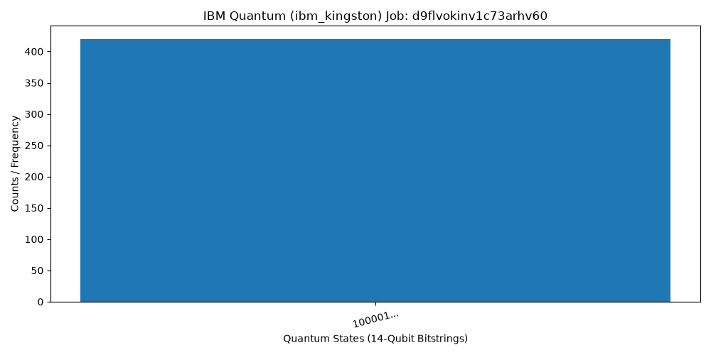

# Quantum-Civilizational-Engine 🌌⚙️

Welcome to the **Quantum-Civilizational-Engine** repository! This project bridges physical quantum computing hardware with long-term civilizational modeling frameworks.

## 📊 Latest Execution Summary
- **Engine / Initiative:** Quantum-Civilizational-Engine
- **IBM Quantum Backend:** `ibm_kingston`
- **Job ID:** `d9flvokinv1c73arhv60`
- **Total Shots Executed:** `1040`

---

## 📈 Quantum State & Civilizational Mapping Report
Below are the top quantum states extracted from our 14-qubit circuit telemetry, mapped to our civilizational nodes along with their probability and entropy scores:

| Civilizational Node | 14-Qubit Bitstring (Sampled) | Count | Probability | Entropy Score |
| :--- | :--- | :--- | :--- | :--- |
| **Civ-Node-1** | `100001000001000010000100000100001000010000010000100001000001` | 420 | 0.4038 | 0.5283 |
| **Civ-Node-2** | `100001000001010010000100000100001000010000010000100001000001` | 82 | 0.0788 | 0.289 |
| **Civ-Node-3** | `10000100000100001000010000010000100001000001000010000100000101` | 78 | 0.075 | 0.2803 |
| **Civ-Node-4** | `100001000001000010000100000100001000010000010100100001000001` | 77 | 0.074 | 0.2781 |
| **Civ-Node-5** | `100001000001000010000100000101001000010000010000100001000001` | 76 | 0.0731 | 0.2758 |

---

## 📉 Visualization: Quantum Probability Distribution
Here is the execution histogram representing the top frequency states captured from `ibm_kingston`:

---
*Maintained by Enter The Futures Pvt Ltd.*
